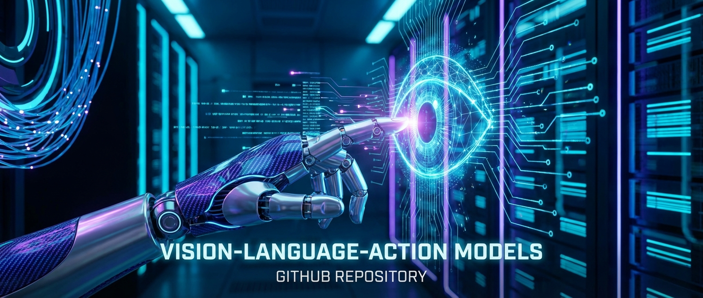

# VLA (Vision-Language-Action) 算法岗面试手册




[](https://opensource.org/licenses/MIT)
[](http://makeapullrequest.com)

> **专注机器 VLA (Vision-Language-Action) 算法岗位的面试准备指南。**
> 从理论基础到真机部署，从灵巧手选型到 Sim-to-Real 实战。

## 📖 项目简介 (Introduction)

随着具身智能 (Embodied AI) 的爆发，VLA (Vision-Language-Action) 模型成为连接数字世界与物理世界的关键。本项目旨在为致力于进入该领域的算法工程师提供一份**全中文、实战导向**的面试与学习手册。

不同于通用的 CV/NLP 面试指南，本项目**聚焦于 Robotics 特有的挑战**：
- **Action Tokenization**: 如何将连续动作离散化？
- **Sim-to-Real**: 如何跨越仿真与真机的鸿沟？
- **Deployment**: 如何在边缘设备 (Jetson) 上部署大模型？
- **Hardware**: 灵巧手与机械臂的选型与控制。

## ✨ 项目亮点 (Highlights)

1. **全中文内容**: 所有文档均使用简体中文编写，专业术语保留英文对照。
2. **最新技术覆盖**:
    - 包含了 **Physical Intelligence (Pi)** 的 π0, π0.5, π0.6 模型解析。
    - 涵盖了 **OpenVLA**, **WALL-OSS** (X Square), **Galaxea G0** (星海图) 等开源 SOTA 模型。
    - 详解了 **FAST** 动作 Token 化（DCT + BPE，5倍训练加速）。
    - 深入讲解 **Knowledge Insulation**（梯度隔离，防止灾难性遗忘）。
    - 新增 **高效微调** (LoRA/QLoRA) 和 **量化理论** (AWQ, GPTQ) 详解。
    - 新增 **空间数学** (坐标系转换, 旋转表示) 和 **评估体系** (Benchmarks, Metrics)。
3. **硬件选型指南**:
    - 重点加强了 **灵巧手 (Dexterous Hands)** 的介绍 (Shadow, Inspire, Unitree)。
    - 新增 **触觉传感器 (Tactile Sensors)** 深度解析 (GelSight, Tashan, Parsen)。
    - 提供了 **Unitree, Agibot, Fourier** 等中国头部机器人公司的详细参数与价格参考。
    - 新增 **国际机器人公司** 和 **亚洲机器人公司** 对比表。
    - 新增 **[传感器集成难点](./deployment/sensor_integration.md)** 专题。
4. **实战导向**:
    - 提供了 **Sim-to-Real** 的具体技术路线 (Domain Randomization, Co-training)。
    - 提供了 **边缘部署** 的实战代码片段 (vLLM, Quantization)。
    - 新增 **仿真环境对比** (Isaac Sim vs MuJoCo vs PyBullet) 选型指南。
    - 新增 **相机标定** 实战指南 (Eye-in-Hand, Eye-to-Hand, Aruco)。

## 📂 项目结构 (Project Structure)

```
/opt/vla-interview-handbook/
├── README.md                   # 项目主页 (Introduction & Roadmap)
├── theory/                     # 理论基础
│   ├── README.md               # 索引
│   ├── README_FUN.md           # 人话版索引 (轻松理解版)
│   ├── vla_arch.md             # VLA 核心架构 (RT-1, RT-2, OpenVLA, Pi, WALL-OSS)
│   ├── transformer_vs_cnn.md   # Backbone 对比 (ViT vs ResNet, SigLIP)
│   ├── action_representations.md # 动作生成范式 (Tokenization vs Diffusion vs Flow)
│   ├── fast.md                 # FAST 动作 Token 化 (DCT + BPE, 5倍加速)
│   ├── diffusion_policy.md     # 扩散策略详解 (DDPM, DDIM, EBM)
│   ├── flash_attention.md      # 性能优化 (Kernel Fusion)
│   ├── literature_review.md    # 核心文献技术归纳 (包含10个模型对比)
│   ├── pi0_flow_matching.md    # Pi0 代码解构 (Flow Matching)
│   ├── pi0_5_dissection.md     # Pi0.5 模型解剖 (Unified Model)
│   ├── pi0_6_dissection.md     # Pi0.6 模型解剖 (Recap RL)
│   ├── wall_oss.md             # WALL-OSS 深度解析 (Uni-CoT, X Square Robot)
│   ├── galaxea_g0.md           # Galaxea G0 双系统 VLA (星海图智能)
│   ├── knowledge_insulation.md # 知识绝缘技术 (防止灾难性遗忘)
│   ├── co_training.md          # 联合训练 (Co-training) 详解
│   ├── tactile_vla.md          # 触觉感知与 VLA
│   ├── data.md                 # 数据处理 (RLDS, Co-training)
│   ├── spatial_math.md         # 空间数学 (坐标系, 旋转表示)
│   ├── evaluation.md           # 评估体系 (Benchmarks, Metrics)
│   ├── peft_lora.md            # 高效微调 (LoRA/QLoRA 原理)
│   └── quantization_theory.md  # 量化理论 (AWQ, GPTQ)
├── product/                    # 🆕 机器人产品大百科
│   ├── README.md               # 产品索引
│   ├── humanoids.md            # 具身智能本体 (Tesla, Unitree)
│   ├── hands.md                # 灵巧手 (Shadow, Inspire)
│   ├── arms.md                 # 科研机械臂 (Franka, UR)
│   ├── grippers.md             # 平行夹爪 (Robotiq, DH)
│   ├── mobile_bases.md         # 移动底盘 (AgileX)
│   └── sensors.md              # 触觉与感知 (GelSight, Tashan)
├── deployment/                 # 真机与部署
│   ├── README.md               # 索引
│   ├── hardware.md             # 硬件选型与价格参考
│   ├── sensor_integration.md   # 🆕 触觉传感器集成难点
│   ├── calibration.md          # 相机标定指南
│   ├── pi0_deployment.md       # Pi0 真机部署
│   ├── dexterous_hand_guide.md # 灵巧手部署实战
│   ├── optimization.md         # 模型优化 (量化, TensorRT)
│   ├── simulation_environments.md # 仿真环境详解 (Isaac Sim, MuJoCo, PyBullet)
│   └── sim_to_real.md          # Sim-to-Real 技术
├── system-design/              # 系统设计
│   ├── README.md               # 索引
│   ├── data_pipeline.md        # 数据闭环设计
│   ├── cloud_infrastructure.md # 云端基础设施
│   └── evaluation.md           # 评估系统设计
├── cheat-sheet/                # 速查表
│   ├── README.md               # 索引
│   ├── timeline.md             # 关键论文时间线
│   └── formulas.md             # 核心公式
├── question-bank/              # 题库与实战
│   ├── README.md               # 索引
│   ├── questions.md            # 面试真题
│   ├── openvla_finetuning.md   # OpenVLA 微调实战
│   └── interviewer_guide.md    # 考官视角指南
└── companies/                  # 🆕 机器人公司与求职
    ├── README.md               # 求职指南索引
    ├── china.md                # 中国机器人公司
    ├── international.md        # 国际机器人公司
    ├── asia.md                 # 亚洲机器人公司 (SG/JP/TW/KR)
    └── embodied_ai.md          # 具身智能软件平台
```

## 🚀 快速开始 (Getting Started)

### 📚 推荐学习路径

#### 学习者/应届生
1. **基础入门**: 先看 [理论基础 (Theory)](./theory/README.md) 的 **Part 1: Foundations**，理解数据格式、动作空间、评估体系。
2. **架构理解**: 深入学习 **Part 2: Architecture & Algorithms**，掌握 VLA 核心架构和生成策略。
3. **产品认知**: 浏览 [产品汇总 (Products)](./product/README.md)，了解主流机器人硬件参数。
4. **实战准备**: 学习 [真机部署 (Deployment)](./deployment/README.md)，掌握硬件选型和模型优化。
5. **求职规划**: 参考 [公司名录 (Companies)](./companies/README.md)，了解行业格局和岗位要求。

#### 在职转岗/跳槽者
1. **速查复习**: 先看 [速查表](./cheat-sheet/README.md) 快速回顾核心概念和公式。
2. **深度补充**: 针对性阅读 [理论基础](./theory/README.md) 中的薄弱环节
   - **最新技术**: FAST, Knowledge Insulation, LoRA/QLoRA, 量化理论
   - **前沿模型**: Galaxea G0, WALL-OSS 双系统架构对比
   - **评估体系**: 理解 Benchmarks 和 Metrics 的设计原理
3. **实战强化**: 重点学习 [真机部署](./deployment/README.md)
   - 仿真环境选型 (Isaac Sim vs MuJoCo)
   - 模型优化与边缘部署
   - Sim-to-Real 技术路线
4. **面试准备**: 刷 [题库](./question-bank/README.md) 模拟真实面试场景。
5. **目标公司**: 在 [公司目录](./companies/README.md) 中锁定意向公司和岗位方向。

#### 面试官/技术Leader
1. **题库设计**: 参考 [面试官视角](./question-bank/interviewer_guide.md)
2. **技术深度**: 查阅 [文献综述](./theory/literature_review.md) 了解前沿
3. **系统设计**: 学习 [系统设计](./system-design/README.md) 评估候选人架构能力

## 🛠️ VLA 开发必备知识 (Development Essentials)

### 数据格式 (Data Formats)
VLA 领域的标准化数据格式至关重要，以下是最常用的：

#### RLDS (Robotic Learning Datasets Spec)
- **标准**: Google DeepMind 主导，TensorFlow-based
- **优势**: 统一格式，Open X-Embodiment 使用
- **缺点**: 依赖 TensorFlow，对 PyTorch 用户不友好
- **使用**: RT-1, RT-2, Octo

#### LeRobot Format
- **标准**: Hugging Face 推出，PyTorch-native
- **优势**: 与 Transformers 生态无缝集成，易用
- **缺点**: 相对较新，社区规模尚小
- **使用**: OpenVLA (可选), WALL-OSS, Galaxea G0

#### 推荐选择
- **新项目**: 优先 **LeRobot Format** (PyTorch 生态)
- **兼容性**: 使用 RLDS，但提供 LeRobot 转换脚本

### 仿真环境 (Simulation Platforms)
| 平台 | 优势 | 劣势 | 适用场景 |
| :--- | :--- | :--- | :--- |
| **Isaac Sim (NVIDIA)** | 物理精度高，GPU加速 | 闭源，依赖NVIDIA硬件 | 人形机器人，大规模并行 |
| **MuJoCo** | 速度快，轻量级 | 接触力模拟有限 | 机械臂操作，快速迭代 |
| **PyBullet** | 完全开源，易上手 | 物理精度一般 | 学术研究，原型验证 |
| **Gazebo** | ROS集成好 | 速度慢 | 移动机器人，SLAM |

### 深度学习框架
- **训练**: **PyTorch** (主流) / JAX (Pi0, Google)
- **部署**: TensorRT, ONNX Runtime, vLLM
- **分布式**: PyTorch FSDP, DeepSpeed

### 机器人中间件
- **ROS 2**: 工业标准，Python/C++ API
- **Isaac Lab**: NVIDIA 仿真-真机框架
- **LeRobot**: Hugging Face 端到端工具链

### 硬件控制接口
- **灵巧手**: CAN Bus, USB, EtherCAT
- **机械臂**: ROS MoveIt, SDK (如 Franka, UR)
- **移动底盘**: ROS Navigation Stack

### 版本控制与实验管理
- **代码**: Git + GitHub/GitLab
- **数据**: DVC, LFS (大文件)
- **实验**: Weights & Biases, TensorBoard

## 🤝 贡献 (Contributing)

欢迎提交 Issue 和 Pull Request！
- 补充最新的 VLA 论文解读。
- 分享你的真机部署经验。
- 提供更多面试真题。

## 📄 许可证 (License)

MIT License
