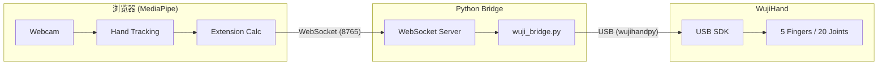

# 实战案例：MediaPipe + WujiHand 实时手势控制系统

> **项目亮点**：实现了从普通摄像头感知到灵巧手动作的端到端联动，并将控制延迟从 **500ms 优化至 50ms**，达到了极高的实时性与流畅度。

---

## 1. 项目概述

本项目实现了通过 MediaPipe 手部追踪（普通摄像头）来实时控制 WujiHand 机械手。用户在摄像头前做手势，机械手会同步模仿这些动作。

### 系统架构

---

## 2. 核心技术实现

### 2.1 手指伸展度计算 (fingerExtension.js)
为了将手部 21 个关键点转化为机械手可理解的指令，我们定义了「伸展度 (Extension, 0-100)」：

- **四指 (食指/中指/无名指/小指)**:
    - 计算 MCP、PIP、DIP 三个关节角度。
    - **加权权重**: `MCP*0.4 + PIP*0.35 + DIP*0.25`（MCP 对视觉观感影响最大）。
    - **映射**: 100° (完全弯曲) → 0%, 165° (完全伸直) → 100%。
- **大拇指 (双维度)**:
    - **Curl (弯曲)**: MCP + IP 关节角度平均。
    - **Spread (展开)**: 拇指尖到食指 MCP 的距离比例（解决大拇指侧向张合问题）。

### 2.2 关节映射与安全控制 (wuji_bridge.py)
Python 后端负责将伸展度转换为弧度 (radians) 并驱动硬件：
- **J1 关节处理**: 四指禁用侧向移动 (J1=0)，大拇指 J1 用于处理 `thumbSpread`。
- **安全机制**: 
    - **ARM 开关**: 防止意外启动。
    - **Reset 序列**: 启动时强制缓慢张开手（限速 1.0 rad/s）。
    - **max_curl 限制**: 预留安全间隙，防止机械手完全握死导致卡住。

---

## 3. 核心挑战：延迟优化（从 500ms 到 50ms）

这是本项目最具技术含量的部分。初始版本存在严重的迟滞感，我们通过以下四步精准优化：

### 3.1 移除冗余的软件滤波
- **之前**: 使用了 One Euro Filter + 速度限制 + 指数平滑，三层滤波叠加导致了巨大的相位延迟。
- **之后**: 移除所有软件滤波，信任硬件端的即时处理。

### 3.2 启用硬件级 LowPass 滤波 (8Hz)
- **原理**: 让硬件在执行电机指令时同步进行平滑处理。
- **优势**: 滤波与执行并行，**不占用控制链路时间**，且运动非常平滑。

### 3.3 移除正常操作下的速度限制
- **优化**: 速度限制只在 `Reset`（安全回归）时启用。正常跟随手势时，直接发送目标位置，消除「跟随感」中的迟滞。

### 3.4 非阻塞 USB 写入 (Unchecked)
- **优化**: 使用 `write_joint_target_position_unchecked()`。不等待硬件返回确认包，直接发送下一帧，节省了 USB 往返时间。

### 延迟分布分析 (优化后总延迟 ~50ms)
| 环节 | 延迟 | 状态 |
| :--- | :--- | :--- |
| **MediaPipe 推理** | ~30ms | 算法瓶颈 (视算力而定) |
| **WebSocket 传输** | ~5ms | 已最小化 |
| **Bridge 逻辑处理** | ~5ms | 已最小化 |
| **USB 写入与响应** | ~10ms | 硬件与 SDK 限制 |

---

## 4. 项目总结与可迁移技能

1. **控制系统思维**: 深刻理解了「滤波器 (Filter) 是一把双刃剑」。在实时控制中，每一层滤波都在用延迟换平滑，必须精确取舍。
2. **软硬协同**: 学会了利用硬件 SDK 原生功能（如硬件 LowPass）来减轻软件层负担。
3. **快速迭代与止损**: 尝试实现四指张缩 (Spread) 发现 MediaPipe 数据不稳后，果断放弃该功能，优先保障核心功能的稳定性。

---

## 5. 面试 Q&A 模拟

**Q: 在实时手势控制项目中，你是如何处理数据抖动与延迟的矛盾的？**
> **A**: 这是最关键的问题。我们最初尝试用软件滤波（如 One Euro Filter）来防抖，但发现叠加多层滤波后延迟飙升到 500ms。后来我优化了方案：1. 将平滑工作交给硬件 SDK 的 LowPass 滤波器，因为它不增加感知延迟。2. 移除正常跟随状态下的速度限制。3. 使用非阻塞 USB 写入。最终在保证运动平滑的前提下，将总延迟降到了 50ms，其中大部分是 MediaPipe 的模型推理时间。

**Q: 为什么大拇指的控制比其他手指复杂？你是如何实现的？**
> **A**: 大拇指是多自由度的，且运动平面与四指不同。我将其拆解为两个维度：`Curl`（弯曲）和 `Spread`（展开）。在 MediaPipe 数据中，我用拇指尖到食指 MCP 的归一化距离来计算展开度，并将其映射到机械手的 J1 关节；弯曲度则映射到 J0/J2/J3。这种双维度映射方案让大拇指的动作比单纯的弯曲映射自然得多。

**Q: 如果摄像头帧率降低，你的系统会崩溃吗？**
> **A**: 不会。系统采用异步架构，Bridge 会持续监听最新的 WebSocket 包。如果帧率降低，机械手会因为硬件 LowPass 的存在而平滑地移动到新位置，而不会出现剧烈的跳变。同时，我设计了 `Reset` 序列和安全限程，保证即使数据丢失，硬件也能安全回位。

---
[← 返回理论目录](../theory/README.md)
