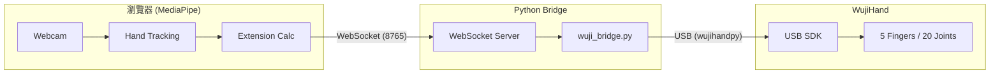

# 實戰案例：MediaPipe + WujiHand 實時手勢控制系統

> **項目亮點**：實現了從普通攝像頭感知到靈巧手動作的端到端聯動，並將控制延遲從 **500ms 優化至 50ms**，達到了極高的實時性與流暢度。

---

## 1. 項目概述

本項目實現了通過 MediaPipe 手部追蹤（普通攝像頭）來實時控制 WujiHand 機械手。用戶在攝像頭前做手勢，機械手會同步模仿這些動作。

### 系統架構

---

## 2. 核心技術實現

### 2.1 手指伸展度計算 (fingerExtension.js)
為了將手部 21 個關鍵點轉化為機械手可理解的指令，我們定義了「伸展度 (Extension, 0-100)」：

- **四指 (食指/中指/無名指/小指)**:
    - 計算 MCP、PIP、DIP 三個關節角度。
    - **加權權重**: `MCP*0.4 + PIP*0.35 + DIP*0.25`（MCP 對視覺觀感影響最大）。
    - **映射**: 100° (完全彎曲) → 0%, 165° (完全伸直) → 100%。
- **大拇指 (雙維度)**:
    - **Curl (彎曲)**: MCP + IP 關節角度平均。
    - **Spread (展開)**: 拇指尖到食指 MCP 的距離比例（解決大拇指側向張合問題）。

### 2.2 關節映射與安全控制 (wuji_bridge.py)
Python 後端負責將伸展度轉換為弧度 (radians) 並驅動硬件：
- **J1 關節處理**: 四指禁用側向移動 (J1=0)，大拇指 J1 用於處理 `thumbSpread`。
- **安全機制**: 
    - **ARM 開關**: 防止意外啟動。
    - **Reset 序列**: 啟動時強制緩慢張開手（限速 1.0 rad/s）。
    - **max_curl 限制**: 預留安全間隙，防止機械手完全握死導致卡住。

---

## 3. 核心挑戰：延遲優化（從 500ms 到 50ms）

這是本項目最具技術含量的部分。初始版本存在嚴重的遲滯感，我們通過以下四步精準優化：

### 3.1 移除冗餘的軟件濾波
- **之前**: 使用了 One Euro Filter + 速度限制 + 指數平滑，三層濾波疊加導致了巨大的相位延遲。
- **之後**: 移除所有軟件濾波，信任硬件端的即時處理。

### 3.2 啟用硬件級 LowPass 濾波 (8Hz)
- **原理**: 讓硬件在執行電機指令時同步進行平滑處理。
- **優勢**: 濾波與執行並行，**不佔用控制鏈路時間**，且運動非常平滑。

### 3.3 移除正常操作下的速度限制
- **優化**: 速度限制只在 `Reset`（安全回歸）時啟用。正常跟隨手勢時，直接發送目標位置，消除「跟隨感」中的遲滯。

### 3.4 非阻塞 USB 寫入 (Unchecked)
- **優化**: 使用 `write_joint_target_position_unchecked()`。不等待硬件返回確認包，直接發送下一幀，節省了 USB 往返時間。

### 延遲分佈分析 (優化後總延遲 ~50ms)
| 環節 | 延遲 | 狀態 |
| :--- | :--- | :--- |
| **MediaPipe 推理** | ~30ms | 算法瓶頸 (視算力而定) |
| **WebSocket 傳輸** | ~5ms | 已最小化 |
| **Bridge 邏輯處理** | ~5ms | 已最小化 |
| **USB 寫入與響應** | ~10ms | 硬件與 SDK 限制 |

---

## 4. 項目總結與可遷移技能

1. **控制系統思維**: 深刻理解了「濾波器 (Filter) 是一把雙刃劍」。在實時控制中，每一層濾波都在用延遲換平滑，必須精確取捨。
2. **軟硬協同**: 學會了利用硬件 SDK 原生功能（如硬件 LowPass）來減輕軟件層負擔。
3. **快速迭代與止損**: 嘗試實現四指張縮 (Spread) 發現 MediaPipe 數據不穩後，果斷放棄該功能，優先保障核心功能的穩定性。

---

## 5. 面試 Q&A 模擬

**Q: 在實時手勢控制項目中，你是如何處理數據抖動與延遲的矛盾的？**
> **A**: 這是最關鍵的問題。我們最初嘗試用軟件濾波（如 One Euro Filter）來防抖，但發現疊加多層濾波後延遲飆升到 500ms。後來我優化了方案：1. 將平滑工作交給硬件 SDK 的 LowPass 濾波器，因為它不增加感知延遲。2. 移除正常跟隨狀態下的速度限制。3. 使用非阻塞 USB 寫入。最終在保證運動平滑的前提下，將總延遲降到了 50ms，其中大部分是 MediaPipe 的模型推理時間。

**Q: 為什麼大拇指的控制比其他手指複雜？你是如何實現的？**
> **A**: 大拇指是多自由度的，且運動平面與四指不同。我將其拆解為兩個維度：`Curl`（彎曲）和 `Spread`（展開）。在 MediaPipe 數據中，我用拇指尖到食指 MCP 的歸一化距離來計算展開度，並將其映射到機械手的 J1 關節；彎曲度則映射到 J0/J2/J3。這種雙維度映射方案讓大拇指的動作比單純的彎曲映射自然得多。

**Q: 如果攝像頭幀率降低，你的系統會崩潰嗎？**
> **A**: 不會。系統採用異步架構，Bridge 會持續監聽最新的 WebSocket 包。如果幀率降低，機械手會因為硬件 LowPass 的存在而平滑地移動到新位置，而不會出現劇烈的跳變。同時，我設計了 `Reset` 序列和安全限程，保證即使數據丟失，硬件也能安全回位。

---
[← 返回理論目錄](../theory/README.md)

