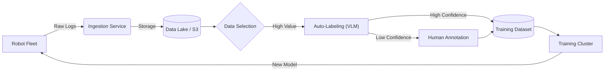

# VLA 数据闭环设计 (Data Pipeline Design)

> **面试场景**: "请设计一套数据处理系统，支持 100 台机器人每天收集 10TB 数据，并能自动迭代模型。"

## 1. 核心理念：数据飞轮 (Data Flywheel)
系统設計的核心目标是构建一个**正向循环**：
1. 模型部署 (Deploy) -> 2. 收集数据 (Collect) -> 3. 筛选与标注 (Filter & Label) -> 4. 训练 (Train) -> 1. 模型部署...

## 2. 架构概览

## 3. 关键模块设计

### 3.1 数据摄取 (Ingestion)
- **挑战**: 带宽瓶颈。100 台机器人 x 100GB/天 = 10TB/天。
- **策略**:
    - **边缘过滤 (Edge Filtering)**: 不要上传所有数据！只上传 "感兴趣" 的片段。
        - *Rule-based*: 触发了急停、任务失败、力矩异常。
        - *Model-based*: 边缘小模型判断 "OOD (Out-of-Distribution)" 分数高的数据。
    - **分级上传**: 文本/Log 实时传，视频晚上闲时传 (WiFi/5G)。

### 3.2 自动标注 (Auto-Labeling)
人工标注太贵且慢，必须依赖 VLM。
- **VLM as a Judge**: 使用 GPT-4o 或 Gemini Pro 分析视频。
    - *Input*: 机器人操作视频。
    - *Prompt*: "Did the robot successfully pick up the apple? If not, why?"
    - *Output*: Success/Failure 标签，以及失败原因 (e.g., "Grasp slip").
- **VLM as an Annotator**: 生成语言指令 (Instruction Generation)。
    - *Input*: 视频片段。
    - *Output*: "The robot is folding a blue t-shirt." (作为 Language Condition).

### 3.3 主动学习 (Active Learning)
如何从海量数据中挑出对模型提升最大的 1%？
- **Hard Negative Mining**: 
    - 找出模型预测的不确定性 (Uncertainty/Entropy) 最高的样本。
    - 找出 Loss 最大的样本。
- **Diversity Sampling**: 确保数据覆盖了不同的场景、光照、物体。使用 Coreset 算法 (如 K-Center Greedy) 在 Embedding 空间采样。

### 3.4 人机回环 (Human-in-the-loop)
VLM 不是万能的。
- **置信度阈值**: VLM 置信度 < 0.8 的数据，路由给人工标注团队。
- **Golden Set**: 每天抽取 1% 的 VLM 标注数据由人工复核，监控 VLM 的标注质量。

## 4. 技术选型 (Tech Stack)
- **数据湖**: AWS S3 / MinIO (存储视频), Iceberg/Delta Lake (元数据管理).
- **工作流调度**: Airflow / Kubeflow Pipelines / Ray Data.
- **标注平台**: Label Studio / CVAT (集成 VLM 插件).
- **向量数据库**: Milvus / Pinecone (用于基于语义的数据检索).

## 5. 面试 Q&A
**Q: 如果 VLM 标注错了怎么办？**
A: 训练数据允许一定的噪声 (Noise Robustness)。只要错误率控制在一定范围内 (e.g., <10%)，大规模数据带来的收益通常大于噪声的危害。可以通过人工抽检 (Spot Check) 和置信度过滤来控制。

**Q: 如何处理隐私问题 (GDPR)?**
A: 在边缘端运行人脸模糊 (Face Blurring) 和 PII (个人敏感信息) 检测模型，在上传前脱敏。

---
[← Back to System Design](./README.md)
