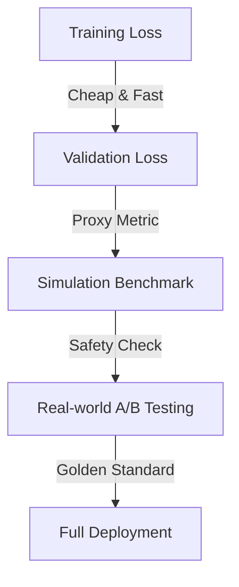

# VLA 评估系统设计 (Evaluation System Design)

> **面试场景**: "模型训练好了，怎么知道它是不是变强了？如何决定是否推送到 100 台机器人上？"

评估 (Evaluation) 是 VLA 数据飞轮中最关键的 "过滤器"。错误的评估会导致 "坏模型" 上线，造成物理损坏。

## 1. 评估的分层架构 (The Evaluation Pyramid)

评估应该是一个漏斗，从便宜到昂贵，从仿真到真机。

### 1.1 Level 0: Training/Validation Loss
- **指标**: Action Prediction Loss (MSE or Cross-Entropy).
- **局限**: **Goodhart's Law**。Loss 降低 $\neq$ 成功率提高。
    - *例子*: 机器人在离目标 1cm 处停下 (Loss 很小)，但没抓到物体 (任务失败)。
- **作用**: 快速过滤掉明显训练失败的模型 (Sanity Check)。

### 1.2 Level 1: Simulation Benchmark (仿真基准)
- **工具**: Isaac Sim, ManiSkill, RLBench.
- **方法**:
    - 在仿真中构建 100+ 个测试场景 (不同的物体位置、光照、桌子高度)。
    - 运行模型 1000 次，计算 **Success Rate (SR)**。
- **挑战**: **Sim-to-Real Gap**。仿真里表现好，真机不一定好。
- **对策**: 
    - 使用 **System Identification** 调整仿真参数。
    - 关注 **相对提升** (Relative Improvement) 而非绝对分数。如果模型 A 在仿真里比模型 B 强 10%，真机上通常也更强。

### 1.3 Level 2: Real-world Proxy (真机代理指标)
- **方法**: 使用预留的 **Golden Validation Set** (高质量真机数据)。
- **Open-Loop Evaluation**: 
    - 给定一段视频的前 $T$ 帧，预测第 $T+1$ 帧的动作。
    - 计算预测动作与真实动作的距离。
- **局限**: 无法评估 **累积误差** (Compounding Error)。

### 1.4 Level 3: Real-world A/B Testing (真机灰度测试)
- **Canary Deployment (金丝雀发布)**:
    - 先推送到 5% 的机器人 (通常是实验室里的测试机)。
    - 运行标准测试任务 (e.g., "连续抓取 50 次")。
- **Shadow Mode (影子模式)**:
    - 在后台运行新模型，但不执行动作。
    - 记录新模型的输出，与当前运行的老模型 (或人类操作) 进行对比。
    - 如果新模型的动作与老模型差异过大 (Anomaly Detection)，则报警。

## 2. 核心指标 (Key Metrics)

除了成功率，还需要关注什么？

| 指标 | 说明 | 重要性 |
| :--- | :--- | :--- |
| **Success Rate (SR)** | 任务完成率 | ⭐⭐⭐⭐⭐ (北极星指标) |
| **Execution Time** | 完成任务所需时间 | ⭐⭐⭐ (效率) |
| **Smoothness (Jerk)** | 动作的平滑度 (加速度的导数) | ⭐⭐⭐⭐ (保护电机，减少磨损) |
| **Safety Rate** | 急停 (E-Stop) 触发频率 | ⭐⭐⭐⭐⭐ (安全底线) |
| **Intervention Rate** | 人类接管频率 (MPI: Miles Per Intervention) | ⭐⭐⭐⭐ (自动驾驶常用) |

## 3. 自动化评估基础设施 (Infrastructure)

### 3.1 Evaluator Service
- 一个独立的微服务，监听 Model Registry。
- 当有新模型 Checkpoint 产生时，自动触发：
    1.  拉取权重。
    2.  启动 Kubernetes Job 运行 Isaac Sim 评估。
    3.  将结果写入 Metadata Store (MLflow/W&B)。
    4.  如果 SR > Threshold，标记为 `candidate-release`。

### 3.2 Visualization
- **W&B Dashboard**: 绘制 Loss 曲线和 Sim SR 曲线。
- **Video Gallery**: 自动保存仿真中失败的案例视频，供人工分析。

## 4. 面试 Q&A

**Q: 为什么 Loss 降了，成功率反而降了？**
A: 这通常是因为 **Distribution Shift** 或 **Overfitting**。
- 模型可能过拟合了训练数据的特定轨迹，导致在稍微不同的初始状态下无法纠偏 (Drift)。
- 解决方法：增加数据增强 (Data Augmentation)，引入噪声，或使用 DAgger (Dataset Aggregation) 收集纠偏数据。

**Q: 如何评估长序列任务 (Long-horizon Tasks)？**
A: 
- **Sub-goal Evaluation**: 将长任务拆解为子目标 (e.g., 打开柜子 -> 拿起杯子 -> 关上柜子)。分别评估每个子目标的成功率。
- **Success weighted by Path Length (SPL)**: 不仅看是否成功，还看路径是否高效。

---
[← Back to System Design](./README.md)
