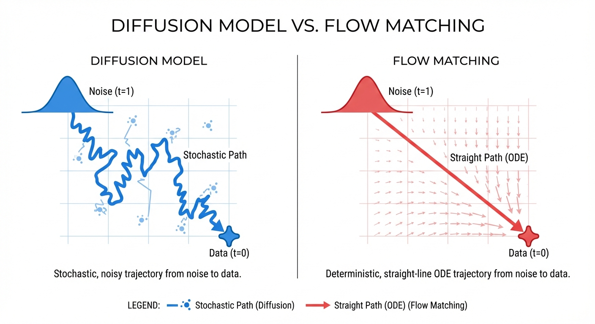

# Pi0 (π0) 代码解构：Flow Matching for VLA

> **注意**: Pi0 已于 2025 年 2 月开源 (OpenPI / LeRobot)。以下代码基于 Flow Matching 原理和 VLA 架构通识进行的 **核心逻辑解构**，方便理解其数学过程。

## 0. 主要數學思想 (Main Mathematical Idea)

> **第一性原理**: **The Shortest Path (最短路径 / Optimal Transport)**

Diffusion 就像一个醉汉（随机游走）跌跌撞撞地从噪声走回数据，路径曲折且低效。Flow Matching 试图构建一条**直达**的路径。

- **核心数学工具**: **ODE (常微分方程)** 与 **Optimal Transport (最优传输)**。
- **解题逻辑**:
    1.  **拉直**: 在概率分布空间中，两点之间（噪声分布 vs 数据分布）最短的路径是直线（Geodesic）。
    2.  **向量场**: 如果我们能直接学习到这条直线上的"速度向量"（Vector Field），那么推理时只需要沿着速度方向走几步（Euler积分）就能到达终点。
    3.  **确定性**: 从随机的布朗运动（Diffusion）转变为确定性的流体运动（Flow），极大地减少了推理步数（100步 -> 10步）。

## 1. 核心思想：从噪声流向动作 (The Math behind Flow)

### 1.1 什么是 Flow Matching?
不同于 Diffusion Model 学习去噪过程 (Denoising Score Matching)，Flow Matching 直接学习一个 **确定性的常微分方程 (ODE)**，定义了概率密度路径 $p_t(x)$ 如何随时间 $t$ 演变。

我们定义一个 **向量场 (Vector Field)** $v_t(x)$，它描述了样本在时间 $t$ 的移动速度和方向。


$$
\frac{dx}{dt} = v_t(x)
$$


- $x_0$: 真实数据分布 (Real Data, e.g., 机器人的正确动作)。
- $x_1$: 标准高斯噪声分布 (Noise, $\mathcal{N}(0, I)$)。
- **目标**: 找到一个向量场 $v_t$，使得当我们从噪声 $x_1$ 出发，沿着这个场逆流而上 (或顺流而下，取决于定义) 积分到 $t=0$ 时，能够精确地变回 $x_0$。

### 1.2 为什么比 Diffusion 好?
- **Diffusion**: 轨迹是随机的 (Stochastic)，像布朗运动一样跌跌撞撞地去噪。推理步数多 (50-100步)。
- **Flow Matching**: 我们可以强制模型学习一条 **"直的" (Straight)** 轨迹。
    - **Optimal Transport (最优传输)**: 点对点之间直线最短。Flow Matching 可以学习这种直线路径，使得推理极其高效 (10步以内)。
    - **确定性与稳定性**: 相比于随机采样，ODE 的确定性使得动作生成更加平滑，减少了高频抖动 (Jitter)，这对机械臂控制至关重要。


*图示: Diffusion 的随机轨迹 (左) vs Flow Matching 的直线轨迹 (右)*

## 2. 核心公式详解 (Key Formulas)

### 2.1 线性插值路径 (Conditional Flow)
为了训练模型，我们需要构造一个"正确答案"。假设我们已知一个真实样本 $x_0$ 和一个采样噪声 $x_1$，我们定义一条连接它们的直线路径：


$$
x_t = (1 - t)x_0 + t x_1, \quad t \in [0, 1]
$$


- 当 $t=0$ 时， $x_t = x_0$ (数据)。
- 当 $t=1$ 时， $x_t = x_1$ (噪声)。

### 2.2 目标速度 (Target Velocity)
对上面的路径 $x_t$ 对时间 $t$ 求导，得到该路径上的理想速度 $u_t(x|x_1)$：


$$
\frac{d}{dt} x_t = \frac{d}{dt} \left( (1 - t)x_0 + t x_1 \right) = x_1 - x_0
$$


- **物理含义**: 目标速度是一个恒定向量，方向从 $x_0$ 指向 $x_1$。这非常直观：要从数据变到噪声，就一直往噪声方向走；反之亦然。

### 2.3 损失函数 (Loss Function)
我们训练一个神经网络 $v_\theta(x_t, t, \text{cond})$ 来拟合这个目标速度。这就是 **Conditional Flow Matching (CFM)** loss：

$$
\mathcal{L}(\theta) = \mathbb{E}_{t, x_0, x_1} \left[ \left\| v_\theta(x_t, t, \text{cond}) - (x_1 - x_0) \right\| ^2 \right]
$$

- **输入**:
    - $x_t$: 当前时刻的插值状态 (混合了数据和噪声)。
    - $t$: 当前时间步。
    - $\text{cond}$: 图像/语言特征 (VLM embedding)。
- **标签 (Target)**: $x_1 - x_0$ (常数向量)。
- **直观解释**: 无论你在路径的哪个位置，网络都应该告诉你："往那个方向走，就能到达终点"。

---

### 2.4 深度补课：Pi0 中的 Flow Matching 数学知识点

如果你对 π0 的 Flow Matching 公式感到陌生，这里是为你准备的数学补丁包：

#### 1. 向量场 $v_\theta$ ：流动的指令
*   **直观理解**：想象你在一根水管里放了一个乒乓球。水管里的每一个水流方向（速度）就构成了一个向量场。
*   **数学含义**：它是一个函数，输入当前动作状态 $x$ 和时间 $t$，输出一个速度向量。它定义了动作如何随时间平滑地“流动”到目的地。

#### 2. 常微分方程 (ODE) ：顺流而下
*   **直观理解**：这就是“跟着箭头走”。
*   **为什么要它**：在控制机器人时，我们需要极高的实时性。ODE 允许我们通过简单的累加（积分）来计算出下一时刻的精确位置，这种确定性比扩散模型的随机采样要稳得多。

#### 3. 线性路径 (Linear Path) $x_t = (1-t)x_0 + tx_1$ ：最简单的一条线
*   **直观理解**：这就是在两点之间拉了一根直线。
*   **为什么用它**：在所有可能的路径中，直线是最容易预测的。Flow Matching 强迫模型学习这条直线路径，这样推理时就不需要弯弯绕绕，几步就能走完。

#### 4. 目标速度 $x_1 - x_0$ ：指路标
*   **直观理解**：这就是从起点到终点的总位移。
*   **数学含义**：在直线路径上，每一秒的速度都是恒定的。我们直接把这个“恒定速度”作为训练标签，模型学起来就像是做“填空题”一样简单直接。

---

## 3. 模型架构 (Pseudo-Code)

### 2.1 VLM Backbone (Conditioning)
使用 PaliGemma 或类似 VLM 提取多模态特征。

```python
class Pi0VLMBackbone(nn.Module):
    def __init__(self, base_vlm):
        super().__init__()
        self.vlm = base_vlm # e.g., PaliGemma-3B
        
    def forward(self, images, text):
        # 1. 提取图像和文本特征
        # output: [batch, seq_len, hidden_dim]
        features = self.vlm.extract_features(images, text)
        
        # 2. Pooling 或提取特定 Token 作为 Condition
        # 假设我们取最后一个 Token 的 embedding 作为全局上下文
        global_cond = features[:, -1, :] 
        return global_cond
```

### 2.2 Flow Matching Policy Head
这是一个 MLP 或 Transformer，预测“速度场”。

```python
class FlowMatchingPolicy(nn.Module):
    def __init__(self, action_dim, cond_dim, hidden_dim=1024):
        super().__init__()
        # Time Embedding: 将标量 t 映射为高维向量，捕捉细粒度的时间信息
        self.time_mlp = nn.Sequential(
            SinusoidalPositionEmbeddings(dim=256),
            nn.Linear(256, 256),
            nn.SiLU()
        )
        
        # 输入: 噪声动作(action_dim) + 时间embedding(256) + 条件(cond_dim)
        self.net = nn.Sequential(
            nn.Linear(action_dim + 256 + cond_dim, hidden_dim),
            nn.SiLU(), # Swish/SiLU 通常比 ReLU 效果更好
            nn.Linear(hidden_dim, hidden_dim),
            nn.SiLU(),
            nn.Linear(hidden_dim, hidden_dim),
            nn.SiLU(),
            nn.Linear(hidden_dim, action_dim) # 输出 dx/dt
        )

    def forward(self, x_t, t, condition):
        # 1. 处理时间 t
        # t: [batch_size, 1] -> t_emb: [batch_size, 256]
        t_emb = self.time_mlp(t)
        
        # 2. 拼接输入
        # 简单的 Concat 策略，更高级的可以用 AdaLN (Adaptive Layer Norm) 注入条件
        input_feat = torch.cat([x_t, t_emb, condition], dim=-1)
        
        # 3. 预测向量场 (Velocity)
        velocity = self.net(input_feat)
        return velocity
```

## 3. 推理过程 (Inference / Sampling)
使用 ODE Solver (如 Euler 方法) 从噪声生成动作。

```python
@torch.no_grad()
def generate_action(policy, vlm_cond, action_dim, steps=10, cfg_scale=1.0):
    """
    从高斯噪声生成动作，支持 Classifier-Free Guidance (CFG)
    """
    batch_size = vlm_cond.shape[0]
    
    # 1. 采样初始噪声 x_1 ~ N(0, I)
    x_t = torch.randn(batch_size, action_dim, device=device)
    
    # 2. 定义时间步 (从 1 到 0)
    dt = -1.0 / steps 
    times = torch.linspace(1.0, 0.0, steps + 1, device=device)
    
    # 3. ODE Solver 循环 (Euler Method)
    for i in range(steps):
        t_curr = times[i]
        
        # 预测当前位置的速度向量 v_t
        # CFG: 同时计算有条件和无条件的速度
        if cfg_scale > 1.0:
            # 构造无条件输入 (空指令/空图像)
            null_cond = torch.zeros_like(vlm_cond) 
            # 批量预测
            input_cond = torch.cat([vlm_cond, null_cond])
            input_x = torch.cat([x_t, x_t])
            input_t = torch.cat([t_curr, t_curr])
            
            v_cond, v_uncond = policy(input_x, input_t, input_cond).chunk(2)
            
            # 组合速度向量
            velocity = v_uncond + cfg_scale * (v_cond - v_uncond)
        else:
            velocity = policy(x_t, t_curr, vlm_cond)
        
        # 更新位置: x_{t+dt} = x_t + v_t * dt
        x_t = x_t + velocity * dt
        
    return x_t
```

## 4. 训练过程 (Training)
Flow Matching 的 Loss 非常直观：**回归目标速度**。
目标速度就是从噪声 $x_1$ 指向真实数据 $x_0$ 的方向。

```python
def compute_loss(policy, vlm_cond, real_action):
    batch_size = real_action.shape[0]
    
    # 1. 采样时间 t ~ U[0, 1]
    t = torch.rand(batch_size, 1, device=device)
    
    # 2. 采样噪声 x_1 ~ N(0, I)
    noise = torch.randn_like(real_action)
    
    # 3. 构建中间状态 x_t (Linear Interpolation / Optimal Transport Path)
    # x_t = (1 - t) * x_0 + t * x_1
    # 注意: 这里定义 t=0 是数据, t=1 是噪声
    x_t = (1 - t) * real_action + t * noise
    
    # 4. 计算目标速度 (Target Velocity)
    # 也就是 x_1 - x_0 (指向噪声的方向? 或者反过来，取决于定义)
    # 在 Conditional Flow Matching (CFM) 中，通常 v_target = x_1 - x_0
    target_velocity = noise - real_action 
    
    # 5. 模型预测速度
    pred_velocity = policy(x_t, t, vlm_cond)
    
    # 6. MSE Loss
    loss = F.mse_loss(pred_velocity, target_velocity)
    return loss
```

## 6. 为什么 Pi0 选择 Flow Matching? (Deep Dive)

### 6.1 连续性 vs 离散性 (Continuous vs Discrete)
- **RT-1/RT-2 (Discrete)**: 将动作空间切分为 256 个格子。
    - *问题*: 丢失精度。对于灵巧手这种需要微米级控制的任务，离散化会导致动作"一卡一卡的" (Jitter)。
- **Pi0 (Continuous)**: 直接输出浮点数速度向量。
    - *优势*: 理论上精度无限，动作平滑，更符合物理世界的本质。

### 6.2 高频控制的数学基础
- 机器人控制回路通常是 500Hz。如果模型推理需要 100ms (10Hz)，中间 490ms 都在"盲跑"。
- Flow Matching 的 **ODE 求解器** 特性允许我们在推理时进行 **时间步缩放 (Time-step Scaling)**。
    - 我们可以只跑 ODE 的 1 步 (Euler Step)，虽然精度略低，但速度极快，可以实现高频响应。
    - 也可以跑 10 步，获得高精度动作。
    - 这种 **Compute-Accuracy Trade-off** 是 Transformer 做不到的。

### 6.3 为什么是直线? (Optimal Transport)
- **Wasserstein Distance**: 在概率分布空间中，将一个分布搬运到另一个分布的"最小代价"路径就是直线 (Geodesic)。
- **OT-CFM**: 我们构造的 $x_t = (1-t)x_0 + t x_1$ 正是 Optimal Transport 的位移插值 (Displacement Interpolation)。
- **Rectified Flow**: 这与 Stable Diffusion 3 使用的 Rectified Flow 思想一致，旨在将弯曲的扩散路径"拉直"，从而允许极少步数的推理 (1-step generation)。

### 6.4 ODE Solver 的选择
- **Euler (1st order)**: 最简单，一步走到底。$x_{t+dt} = x_t + v_t dt$。速度最快，但误差最大。
- **Midpoint / Heun (2nd order)**: 先试探性走半步，看斜率，再修正。精度更高，但需要 2 倍的 NFE (Number of Function Evaluations)。
- **RK4 (4th order)**: 经典的高精度求解器，需要 4 倍 NFE。
- **结论**: 在机器人控制中，通常使用 **Euler** (追求极速) 或 **Heun** (追求平衡)。由于 Flow Matching 训练出的向量场非常平滑 (直线)，Euler 方法通常已经足够好用。


---
[← Back to Theory](./README.md)
